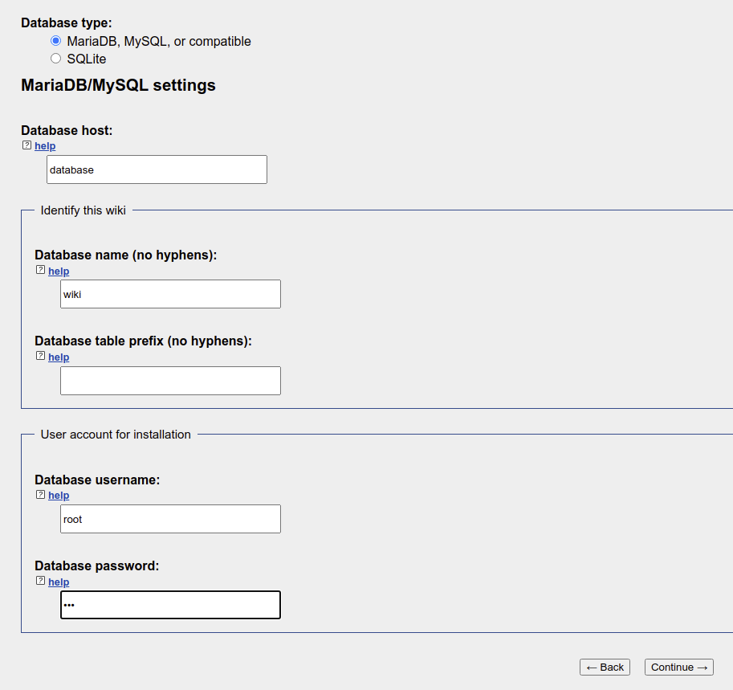

# Local WikiMedia
Welcome to this wonderful repository !
It should allow you to install a local WikiMedia in less than 10 minutes (thanks to Docker).

## Summary
- [Use](#use)

## Use
### Setup
First, you have to install [docker engine](https://docs.docker.com/engine/install/) on your host machine.

Then, install [docker-compose](https://docs.docker.com/compose/install/).

Now, go in your worspace directory and clone the repository :
```
$ git clone ssh://git@github.com:Gnucki/media-wiki.git && cd media-wiki
```

Next step is setuping your environment :
```bash
$ make setup
```
> You can chose the installed version of MediaWiki distribution specifying the `MEDIA_WIKI_VERSION` variable in your `.env` file.

If everything went well, you should be able to access the config page : `http://localhost:7080/mw-config/`.<br>

Last thing you have to do to finish technical installation is to configure the database connection :
 
> Default password is `pwd`. Feel free to change it in your `.env` file.

Enjoy !

### Start
To start docker environment (when you restart your host, for instance), use the following command :
```sh
$ make start
```

To stop all containers :
```sh
$ make stop
```

You can also restart one or all containers :
```sh
$ make restart
```

### Save and restore
You can create a backup of your data and settings :
```
$ make save
```
> Remember to upload the artifact in a safe place

To restore a backup of your data and settings, place your backup file to restore in `.run/backups/backup.tar.gz`, then execute the following command :
```
$ make restore
```
> This command will backup your current data before executing

### Display logs
Display current logs :
```sh
$ make log
```

Display current logs and watch for new ones :
```sh
$ make log-watch
```
